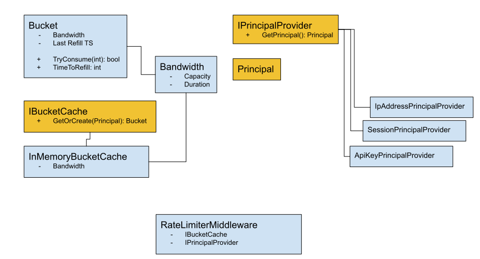

# Simple Rate Limiter


The _Simple Rate Limiter_ is loosely based on the [Token Bucket](https://en.wikipedia.org/wiki/Token_bucket) algorithm.
From Wikipedia...

> The token bucket algorithm is based on an analogy of a fixed capacity bucket into which tokens, normally representing
> a unit of bytes or a single packet of predetermined size, are added at a fixed rate. When a packet is to be checked
> for conformance to the defined limits, the bucket is inspected to see if it contains sufficient tokens at that time.
> If so, the appropriate number of tokens, e.g. equivalent to the length of the packet in bytes, are removed
> ("cashedin"), and the packet is passed, e.g., for transmission. The packet does not conform if there are insufficient
> tokens in the bucket, and the contents of the bucket are not changed.

This rate limiter maintains token buckets per IP address and rejects requests with a
[HTTP 429 - Too Many Requests](https://http.cat/429) response when capacity is exhausted.

## Initial design



### Glossary

* A _Principal_ represents entities that make requests. These are identified from the HTTP request, for example by
  - IP Address
  - API key
  - Session cookie
* _Bandwidth_ defines the token capacity and rate of _refill_, eg 100 tokens (requests) per hour.
* _Buckets_ maintain state for available tokens and _refill_ times per _principal_.
* _Refill_ means to replenish a _bucket's_ tokens after a set interval.

## Implementation details

The idea behind this rate limiting middleware was to provide a simple means of identifying request entities and
maintaining a quota of requests.

Entities, or _principals_ are identified by source IP address though this could be extended to any request meta-data
such as an API key header or query parameter.

Quotas are maintained in a thread-safe, in-memory cache using
[Microsoft.Extensions.Caching.Memory](https://www.nuget.org/packages/Microsoft.Extensions.Caching.Memory/)
`MemoryCache`. This allows a single process to tally and reject excessive requests.

Areas for extension would be to provide a distributed store for horizontally scalable applications using something like
a central database or [distributed cache](https://hazelcast.com/glossary/distributed-cache/).

### Design considerations

Initially I considered maintaining a per-bucket timing process to manage the refill task however this seemed potentially
problematic...

* Timers need to be cleared when buckets are evicted from the cache
* High load from multiple sources would generate a large number of timers, putting pressure on CPU
* Timers would continue to run even with no requests

I instead decided to use simple time-based comparison and arithmetic, storing only the last known refill timestamp in
each bucket and comparing it to the current time to determine if it was time to refill.

Buckets are evicted from the cache using a sliding-window equal to the same duration as the bucket refill interval.
This allows buckets for request sources with low usage to be removed from memory as soon as possible.

These decisions impose a slight limitation in the system in that request tallies only begin with an inbound request and
not based on a set clock interval.

## See it in action!

An example web API project based on the default Microsoft _Weather Forecast_ template has been provided in
[`examples/RateLimiter.Example`](./examples/RateLimiter.Example).

This API has been configured to limit requests per source IP address to one every minute.

### Requirements

* [Docker](https://docs.docker.com/get-docker/) with [Docker Compose](https://docs.docker.com/compose/) or
  [.NET 5.0](https://dotnet.microsoft.com/download/dotnet/5.0).

### Run the API with docker compose

The API can be started via the following command

```shell
docker compose up --build
```

### Run the API with the dotnet CLI

The API can be started via the following command

```shell
dotnet run -p examples/RateLimiter.Example/RateLimiter.Example.csproj
```

### Simulate requests

Open <http://localhost:5000/WeatherForecast> in your favourite HTTP client (browser, cURL, Postman, etc).

The first request will generate some nice, random weather data as JSON.

Subsequent requests within the same minute will be rejected with a message like...

> Rate limit exceeded. Try again in #59 seconds

## Example usage

Register the required services with the startup services collection

```c#
public void ConfigureServices(IServiceCollection services)
{
    // Configure rate limiting at 100 requests per hour
    services.AddRateLimiting(new RateLimitOptions
    {
        Capacity = 100,
        Duration = TimeSpan.FromHours(1)
    });
}
```

Then configure the rate limiting middleware to handle requests

```c#
public void Configure(IApplicationBuilder app, IWebHostEnvironment env)
{
    app.UseRateLimiter();
    
    app.UseEndpoints(endpoints => { endpoints.MapControllers(); });
}
```

## Tests

A comprehensive unit test suite is provided in [test/RateLimiter.UnitTest](./test/RateLimiter.UnitTest). Tests can be
executed via the following `dotnet` CLI command

```shell
dotnet test
```
